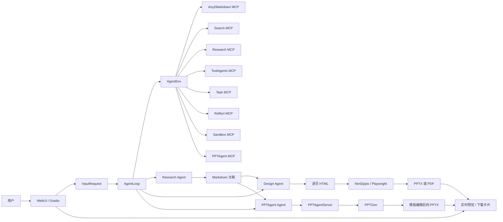
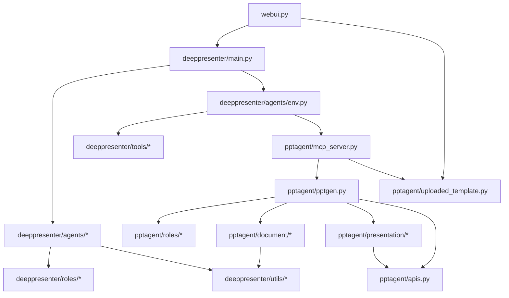
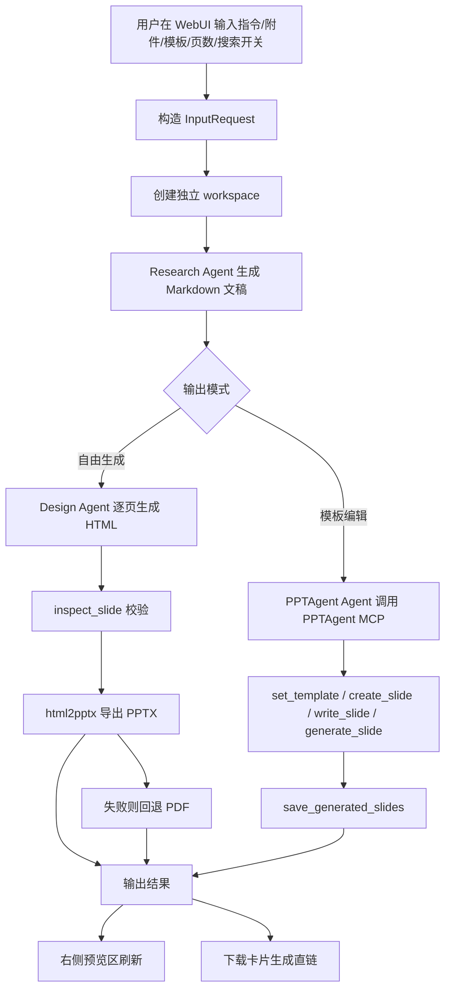

# PPTAgentV3 项目实现说明

## 1. 文档目标

本文档用于说明当前 `PPTAgentV3` 项目的真实实现方式，重点覆盖：

- 系统整体架构
- 端到端生成流程
- 关键模块职责
- 两种 PPT 生成模式的差异
- 当前版本新增能力
- 可直接用于课程/项目报告的描述框架

本文档基于当前仓库代码整理，而不是只复述 `README.md`。

---

## 2. 项目定位

`PPTAgentV3` 是一个面向演示文稿自动生成的多智能体系统。它支持两类工作模式：

1. 自由生成模式（`deeppresenter`）
   从用户指令和附件出发，先产出 Markdown 文稿，再由设计智能体生成逐页 HTML，最后导出为 `PPTX/PDF`。

2. 模板编辑模式（`pptagent`）
   从用户指令、附件和模板出发，先产出 Markdown 文稿，再基于既有 PPT 模板逐页编辑并生成最终 `PPTX`。

项目的核心特点不是“单次大模型回答”，而是“多阶段 Agent 编排 + MCP 工具调用 + 工作区产物驱动”的自动化流水线。

---

## 3. 技术栈概览

### 3.1 前端与交互层

- `Gradio`：构建 WebUI
- 流式消息与渐进预览：通过异步生成器把 Agent 执行过程实时推送到前端

### 3.2 编排与模型层

- `OpenAI-compatible API`：统一接入研究模型、设计模型、长上下文模型、视觉模型、文生图模型
- `Pydantic`：配置、消息、请求结构建模
- `Jinja2`：Role Prompt 模板化

### 3.3 工具与运行时层

- `FastMCP`：把解析、搜索、文件操作、反思、PPT 编辑能力暴露为工具
- `Docker sandbox`：为文件读写、命令执行等工具提供隔离环境
- `Playwright`：HTML 渲染、PDF 导出、页面截图
- `MinerU / MarkItDown`：附件解析
- `Tavily / arXiv / Semantic Scholar`：搜索与研究

### 3.4 PPT 处理层

- `python-pptx` 兼容生态
- 自研 `Presentation / SlidePage / ShapeElement / Layout`
- `pptagent_pptx`：更细粒度地编辑 PPT 形状、段落和图片

---

## 4. 代码组织

| 目录/文件 | 作用 |
| --- | --- |
| `webui.py` | WebUI 入口、会话创建、流式消息、预览与下载 |
| `deeppresenter/main.py` | 总控编排器 `AgentLoop` |
| `deeppresenter/agents/` | Research / Design / PPTAgent 三类上层 Agent |
| `deeppresenter/tools/` | MCP 工具服务，如解析、搜索、反思、任务管理 |
| `deeppresenter/utils/` | 配置、类型、日志、HTML/PDF/PPT 转换、MinerU 适配 |
| `deeppresenter/roles/` | 各 Agent 的系统提示词和工具约束 |
| `pptagent/mcp_server.py` | 模板化 PPT 生成工具服务 |
| `pptagent/pptgen.py` | PPT 生成核心流程：大纲、布局、内容、编辑、校验 |
| `pptagent/document/` | Markdown 文稿的结构化解析 |
| `pptagent/presentation/` | PPT 模板解析、幻灯片对象和形状对象抽象 |
| `pptagent/uploaded_template.py` | 上传模板预处理与“按原模板直接编辑”支持 |

### 4.1 模块功能详解

下面从“交互层 -> 编排层 -> 工具层 -> PPT 引擎层”四个方向，对主要模块做更细的功能说明。

#### A. 交互层模块

##### `webui.py`

这是整个系统的 Web 入口，也是用户唯一直接接触的模块。

主要功能：

- 加载运行配置
  - 通过 `load_runtime_config()` 读取 `config.yaml` 和 `mcp.json`
- 构建页面
  - 创建输入面板、结果面板、预览区、下载区、Token 统计区、执行轨迹区
- 管理用户会话
  - 用 `UserSession` 为每次生成创建独立的 `AgentLoop`
- 组装请求
  - 把指令、附件、页数、输出模式、模板、搜索开关封装为 `InputRequest`
- 处理上传模板
  - 调用 `prepare_uploaded_template()` 预处理用户上传的 PPT 模板
- 驱动流式输出
  - 在 `send_message()` 中异步消费 `AgentLoop.run()` 的消息流
- 在线预览
  - PPT 模式下读取 `.preview/live_preview.pptx`
  - 自由生成模式下读取 `slides/*.html`
- 文件下载
  - 生成下载卡片和文件直链

输入：

- 用户文本指令
- 附件
- 模板选择或模板上传
- 页数和搜索开关

输出：

- 聊天式执行日志
- 右侧在线预览
- 下载链接
- Token 使用统计

#### B. 编排层模块

##### `deeppresenter/main.py`

这是任务编排核心，实现类是 `AgentLoop`。

主要功能：

- 为任务创建 workspace
- 启动 `AgentEnv`
- 顺序调度 `Research Agent`
- 根据模式分流到：
  - `Design Agent`
  - `PPTAgent Agent`
- 统一保存中间产物索引
- 控制最终输出路径和回退逻辑
- 控制搜索开关对工具集的影响

输入：

- `InputRequest`

输出：

- 过程消息流 `ChatMessage`
- 最终产物路径
- `intermediate_output.json`

##### `deeppresenter/agents/agent.py`

这是 `deeppresenter` 侧所有 Agent 的基类。

主要功能：

- 加载角色 Prompt 配置
- 渲染 Jinja2 Prompt
- 管理聊天历史和上下文折叠
- 调用 LLM 发起 tool calling
- 执行工具调用并把结果转成统一消息
- 记录 token 消耗与历史
- 支持运行时移除某些工具

它本质上定义了“一个支持工具调用的 Agent 应该如何工作”。

##### `deeppresenter/agents/research.py`

Research Agent 的外层封装。

主要功能：

- 调用基类 `action()`
- 把 `req.deepresearch_prompt` 和附件交给模型
- 在多轮工具调用后，等待 `finalize()` 返回 Markdown 文稿路径

##### `deeppresenter/agents/design.py`

Design Agent 的外层封装。

主要功能：

- 读取 Research 阶段输出的 Markdown 文件
- 生成 `design_plan.md`
- 逐页生成 `slides/slide_xx.html`
- 调用 `inspect_slide` 检查视觉质量和可导出性

##### `deeppresenter/agents/pptagent.py`

PPTAgent Agent 的外层封装。

主要功能：

- 读取 Research 阶段生成的 Markdown 文稿
- 按 `PPTAgent.yaml` 的固定工具流程与 `pptagent.mcp_server` 交互
- 输出最终 PPT 路径

##### `deeppresenter/agents/env.py`

这是工具运行时环境，也可以理解为“Agent 的工具总线”。

主要功能：

- 读取 `mcp.json`
- 启动并连接所有 MCP server
- 向工具进程注入：
  - `WORKSPACE`
  - `HOST_WORKSPACE`
  - `CONFIG_FILE`
  - 代理相关环境变量
- 缓存工具 schema
- 统一执行工具
- 截断超长工具输出并落盘
- 记录工具耗时与调用历史

它把“LLM 可调用工具”与“底层进程服务”连接起来，是整个系统的基础设施核心之一。

#### C. 工具层模块

##### `deeppresenter/tools/any2markdown.py`

负责把附件解析成 Markdown。

主要功能：

- PDF 走 MinerU 在线或离线解析
- 其他文档走 MarkItDown
- 将图片统一落地到本地目录
- 把 Markdown 中的相对图片路径改成绝对路径
- 生成 `markdown_file` 和图片清单

适用场景：

- 用户上传 PDF、Word、网页导出文档、带图文混排材料

##### `deeppresenter/tools/search.py`

负责联网检索和素材抓取。

主要功能：

- `search_web()`：网页搜索
- `search_images()`：图片搜索
- `fetch_url()`：抓取网页正文
- `download_file()`：下载远程文件到 workspace

它承担的是通用互联网信息获取能力。

##### `deeppresenter/tools/research.py`

负责学术研究相关工具。

主要功能：

- `search_papers()`：检索 arXiv 论文
- `get_paper_authors()`：查询作者信息
- `get_scholar_details()`：查询学者详情和代表论文

适合学术汇报、论文综述、研究计划书场景。

##### `deeppresenter/tools/tool_agents.py`

这是“由模型提供能力”的工具集合。

主要功能：

- `image_generation()`：文生图
- `image_caption()`：视觉理解与图像描述
- `document_summary()`：长文总结和任务导向摘要

这类工具的特点是：虽然也是工具，但内部仍然依赖模型推理。

##### `deeppresenter/tools/task.py`

负责任务辅助控制。

主要功能：

- Todo 管理
- `thinking()` 显式思考记录
- `finalize()` 对 Agent 输出做最终校验

其中 `finalize()` 很关键，它会检查：

- Research 输出是否是 Markdown
- PPTAgent 输出是否是非空 PPTX
- Design 输出目录下是否存在 HTML

##### `deeppresenter/tools/reflect.py`

负责质量反思与校验。

主要功能：

- `inspect_slide()`：校验 HTML 幻灯片
  - 可调用 `html2pptx`
  - 可做字体可读性审计
  - 在多模态模式下可把页面转成图像供模型反思
- `inspect_manuscript()`：校验 Markdown 文稿中的图片和分页情况

这是当前版本控制“自由生成质量”的关键模块。

#### D. 工具支撑与公共模块

##### `deeppresenter/utils/typings.py`

统一定义核心数据结构。

主要功能：

- 定义 `InputRequest`
- 定义 `ChatMessage`
- 定义 `ConvertType`、`Role`、`MCPServer`
- 负责生成各 Agent 的 Prompt 文本
- 注入运行时增强信息
  - 搜索开关
  - 上传模板 direct edit 元数据

##### `deeppresenter/utils/config.py`

负责配置和模型访问封装。

主要功能：

- 读取 YAML 配置
- 统一包装模型端点
- 支持多个 endpoint 轮询重试
- 支持 tool calling 和结构化输出
- 支持图像生成接口

##### `deeppresenter/utils/webview.py`

负责 HTML、PDF、PPTX 之间的可视化转换。

主要功能：

- `PlaywrightConverter`
  - HTML -> PDF
  - PDF -> 图片
- `convert_html_to_pptx()`
  - 调用 Node 侧 `html2pptx_cli.js`

它是自由生成模式中的导出核心。

##### `deeppresenter/utils/mineru_api.py`

负责本地/在线 MinerU 适配。

主要功能：

- 在线 MinerU：申请上传链接、轮询结果、下载 ZIP
- 离线 MinerU：多种请求字段自动重试
- 自动解压解析结果

当前版本对本地 MinerU 做了更强的兼容适配。

#### E. PPT 引擎层模块

##### `pptagent/mcp_server.py`

这是模板编辑模式下最重要的工具服务。

主要功能：

- 动态加载内置模板和上传模板
- 暴露模板相关工具：
  - `list_templates`
  - `set_template`
  - `create_slide`
  - `write_slide`
  - `generate_slide`
  - `save_generated_slides`
- 维护 live preview 快照
- 处理 direct edit mode

它相当于把复杂的 PPT 生成能力包装成了“可被 LLM 调用的流程化工具”。

##### `pptagent/uploaded_template.py`

负责上传模板预处理。

主要功能：

- 解析用户上传的 `.pptx`
- 兼容复杂分组形状
- 抽取可编辑文本元素
- 生成运行时模板包：
  - `source.pptx`
  - `slide_induction.json`
  - `image_stats.json`
  - `metadata.json`
  - `description.txt`
- 标记哪些页可编辑、哪些页保留

它是“在上传模板上直接编辑”这一能力的核心。

##### `pptagent/pptgen.py`

这是 PPT 生成核心引擎。

主要功能：

- 加载模板参考信息
- 生成整份大纲
- 选择页面布局
- 生成元素内容
- 进行内容长度重写
- 生成编辑命令
- 执行模板页编辑
- 校验并保存结果

它定义了模板化 PPT 生成的完整算法流程。

##### `pptagent/agent.py`

这是 `pptagent` 内部角色 Agent 的轻量封装。

主要功能：

- 加载 `planner/editor/layout_selector/coder/content_organizer` 的 YAML Prompt
- 维护角色自己的历史
- 支持失败重试
- 支持结构化 JSON 输出

与 `deeppresenter/agents/agent.py` 相比，它更轻量，聚焦于 PPT 引擎内部角色协作。

##### `pptagent/document/`

负责把 Markdown 文稿结构化。

主要功能：

- 将 Markdown 解析为章节、子节、图片、表格对象
- 提供 `get_overview()`、`iter_medias()` 等访问接口
- 校验媒体资源路径
- 为布局选择和页面生成提供结构化内容源

##### `pptagent/presentation/`

负责把真实 PPT 模板转换为可编辑抽象。

主要功能：

- `Presentation.from_file()`：解析模板文件
- `SlidePage`：单页抽象
- `ShapeElement` 体系：文本、图片、分组、背景等对象
- `Layout`：定义某类模板页的内容 schema
- `validate()` / `save()`：把抽象重新构建为 PPTX

这是模板理解和模板保真编辑的基础。

##### `pptagent/apis.py`

负责实际的 PPT 编辑动作执行。

主要功能：

- 替换段落
- 克隆段落
- 删除段落
- 替换图片
- 表格与形状编辑
- `CodeExecutor` 执行由 `coder` 输出的 API 命令

可以把它理解为“PPT 原子编辑指令层”。

##### `pptagent/roles/`

保存 `planner/editor/coder/layout_selector/content_organizer` 等角色的提示词模板。

主要功能：

- 约束每个子角色的职责
- 给不同阶段的模型提供稳定 Prompt
- 支撑 `pptgen.py` 的多角色协作

### 4.2 模块之间的协作关系

从协作角度看，模块间可以概括为如下链路：

1. `webui.py`
   - 收集用户输入
   - 调用 `AgentLoop`

2. `AgentLoop`
   - 调用 `Research Agent`
   - 决定走 `Design Agent` 还是 `PPTAgent Agent`

3. `AgentEnv`
   - 为所有 Agent 提供统一 MCP 工具访问能力

4. `deeppresenter/tools/*`
   - 提供附件解析、搜索、反思、总结、任务收尾等通用能力

5. `pptagent/*`
   - 负责模板加载、结构抽象、逐页编辑和最终 PPTX 生成

6. `webui.py`
   - 最后负责预览展示、下载输出和交互状态更新

### 4.3 为什么要这样拆模块

这种模块划分有几个明显优势：

- 单一职责清晰
  - UI、编排、工具、PPT 引擎分别演进
- 易于替换
  - 搜索服务、MinerU、LLM 模型、模板都可替换
- 易于调试
  - workspace、HTML 中间产物、PPT 预览文件都可以单独检查
- 易于扩展
  - 新增工具、新增模板模式、新增 Agent 都不必重写整个系统

### 4.4 关键函数级实现细节

前面的模块说明回答的是“谁负责什么”，这一节进一步回答“模块内部具体怎么跑”。

#### 4.4.1 `webui.py` 的请求处理主线

WebUI 真正驱动生成的核心函数是 `send_message()`，它不是简单地调用一个后端接口，而是一个异步生成器，边执行边向前端推送状态。

它的内部步骤可以概括为：

1. 创建 `UserSession`
   - 初始化新的 `AgentLoop`
   - 为当前任务分配新的 session 目录

2. 解析前端状态
   - 读取用户输入文本
   - 读取附件列表
   - 读取输出模式
   - 读取模板选择
   - 读取上传模板路径
   - 读取页数和搜索开关

3. 构造 `extra_info`
   - 写入 `enable_search`
   - 如果是上传模板模式，则写入：
     - `pptagent_direct_edit`
     - `template_slide_count`
     - `editable_template_layout_names`
     - `preserved_template_slide_indices`

4. 初始化前端状态
   - 聊天框先显示“处理中”
   - 下载卡片置空
   - 预览区置为等待中

5. 调用 `AgentLoop.run()`
   - `send_message()` 不会一次性等待结果，而是反复 `anext(stream)` 拉取消息
   - 这样前端才能看到中间消息、工具调用记录和渐进预览

6. 处理超时空档
   - 如果 1 秒内没有新消息，则认为任务仍在执行
   - 模板模式下尝试刷新 `.preview/live_preview.pptx`
   - 自由生成模式下尝试刷新 `slides/*.html`

7. 处理最终产物
   - 当 `yield_msg` 是文件路径时，表示任务完成
   - 解析最终文件路径
   - 构建下载卡片
   - 构建 PPT/PDF 在线预览

8. 处理中间消息
   - 如果 `yield_msg` 是 `ChatMessage`
   - 则把系统消息、工具结果、工具调用参数统一转成聊天记录

这种实现的好处是：

- 适配长耗时任务
- 用户可见中间过程
- 生成时即可预览，而不是只能等待最后结果

#### 4.4.2 `AgentLoop.run()` 的阶段编排

`AgentLoop.run()` 是系统总控函数，内部是一个典型的“阶段式状态机”。

它的执行步骤如下：

1. 校验模型能力
   - 如果启用了 heavy reflect，但设计模型不是多模态，会打印警告
   - 可选执行 LLM 可用性验证

2. 复制用户附件到 workspace
   - 由 `InputRequest.copy_to_workspace()` 完成
   - 这样后续工具都只操作任务私有副本

3. 记录输入
   - 把整个请求写入 `.input_request.json`

4. 打开 `AgentEnv`
   - 启动全部 MCP 服务
   - 建立工具连接

5. 运行 `Research Agent`
   - 持续 `yield` 研究过程消息
   - 当 Research 完成后拿到 Markdown 路径
   - 保存到 `intermediate_output["manuscript"]`

6. 模式分流
   - 如果 `convert_type == PPTAGENT`
     - 进入模板编辑链路
   - 否则
     - 进入自由设计链路

7. 模板链路
   - 运行 `PPTAgent Agent`
   - 取回 `pptx` 路径
   - 如果返回的是 live preview 路径，则拷贝为最终交付文件

8. 自由生成链路
   - 运行 `Design Agent`
   - 得到 `slides/` 目录
   - 继续调用 `convert_html_to_pptx()`
   - 如果失败，则记录 `.html2pptx-error.txt`
   - 但仍生成 PDF，确保至少有可查看结果

9. 保存 `intermediate_output.json`
   - 统一记录：
     - `manuscript`
     - `slide_html_dir`
     - `pptx`
     - `final`

10. 返回最终结果路径

这说明 `AgentLoop` 的职责不是生成内容，而是保证阶段串联、状态落盘和异常回退。

#### 4.4.3 `deeppresenter/agents/agent.py` 的工具调用循环

`Agent` 基类内部有两个关键动作：

- `action()`：让模型决定下一步要不要调工具
- `execute()`：真正执行工具

##### `action()` 做了什么

1. 如果当前是第一次调用，则把渲染后的用户 Prompt 放入聊天历史
2. 调用模型，附带当前可用工具 schema
3. 解析模型返回：
   - 文本内容
   - tool calls
   - reasoning
4. 包装成 `ChatMessage`

##### `execute()` 做了什么

1. 遍历所有 tool calls
2. 解析工具参数 JSON
3. 如果检测到 `finalize`
   - 自动补上 `agent_name`
   - 记录 `finish_id`
4. 并发执行工具
5. 将工具返回统一包装成 `ChatMessage`
6. 把图像型返回适配到不同模型格式
   - Gemini / Qwen：转成用户消息
   - Claude：转成 Anthropic 兼容格式
7. 把工具结果追加到聊天历史
8. 检查是否触发 `finalize`
9. 检查上下文窗口
   - 超过阈值时触发历史压缩 `compact_history()`

##### 上下文压缩机制

当上下文太长时，Agent 不会立刻失败，而是：

1. 保留头部关键历史
2. 保留尾部最近对话
3. 让模型总结中间历史
4. 把总结结果重新插入上下文

因此项目具备一定的长任务上下文维持能力。

#### 4.4.4 `AgentEnv.tool_execute()` 的结果包装逻辑

这个函数是“工具执行结果如何反馈给模型”的关键。

执行流程如下：

1. 根据工具名判断：
   - 本地注册工具
   - 还是 MCP server 工具

2. 执行工具并计时

3. 处理异常：
   - 工具不存在
   - 超时
   - 运行失败

4. 检查返回内容格式
   - 当前只支持一个 block
   - block 必须是 `text` 或 `image`

5. 对超长文本做截断
   - 如果长度超过阈值，则只保留前半部分
   - 同时把完整内容落盘到 workspace
   - 提醒模型后续可以继续 `read_file`

6. 转成统一的 `ChatMessage`

这个设计避免了：

- 模型被超长工具输出塞爆上下文
- 工具返回格式不统一导致后续处理混乱

#### 4.4.5 `any2markdown.convert_to_markdown()` 的解析流程

该函数负责把“任意附件”转成系统能理解的 Markdown。

具体流程：

1. 创建输出目录
2. 检查目录是否为空
3. 根据文件类型分支：
   - PDF + MinerU 配置存在
     - 调用 MinerU 在线或离线解析
   - 否则
     - 调用 MarkItDown 本地解析

4. 对解析结果做后处理：
   - 抽取 base64 图片
   - 落地到 `images/`
   - 重写 Markdown 中的图片路径

5. 返回：
   - `markdown_file`
   - 图片分辨率列表

也就是说，Research 阶段看到的“附件内容”并不是原始 PDF，而是已经被转换成带本地图片路径的 Markdown。

#### 4.4.6 `reflect.inspect_slide()` 的校验顺序

当前版本的 `inspect_slide()` 有两个连续阶段：

1. 静态 HTML 审计
   - 扫描 `<style>` 和内联样式里的 `font-size`
   - 对大标题、正文、辅助信息做最小字号校验
   - 如果不满足阈值，直接失败

2. 动态导出校验
   - 调用 `convert_html_to_pptx()`
   - 检查是否存在 `overflow`
   - 如果启用反思模式，还会进一步把页面渲染成图像供模型检查

这意味着当前自由生成模式的页面至少要同时满足：

- 可读
- 可导出
- 布局不过界

#### 4.4.7 `prepare_uploaded_template()` 的运行时模板构建

上传模板不是简单保存原文件，而是会转换成一套运行时模板包。

执行流程如下：

1. 检查扩展名是否为 `.pptx`
2. 根据模板文件内容计算 `md5`
3. 生成缓存目录名
4. 如果缓存已存在且版本一致，则直接复用
5. 否则重新生成：
   - 复制源 PPT 到 `source.pptx`
   - 解析 PPT
   - 处理嵌套 group 兼容
   - 提取图片统计信息
   - 提取可编辑文本元素
   - 构建 `slide_induction.json`
   - 写入 `metadata.json`
   - 写入 `description.txt`

最终生成的目录实际上就是一个“临时模板包”。

这说明上传模板功能本质上是“模板运行时编译”，而不是“上传即用”。

#### 4.4.8 `PPTAgentServer` 的工具状态机

`pptagent/mcp_server.py` 把复杂的 PPT 生成过程包装成一组可被模型调用的工具。

这些工具之间有严格顺序：

1. `list_templates()`
   - 列出可用模板

2. `set_template(template_name)`
   - 加载模板
   - 初始化布局集合
   - 如果是上传模板则进入 `direct_edit_mode`

3. `create_slide(layout)`
   - 选择本页布局
   - 返回内容 schema

4. `write_slide(structured_slide_elements)`
   - 写入本页结构化内容
   - 做布局级校验

5. `generate_slide()`
   - 调用 `PPTGen` 生成幻灯片
   - 更新 live preview
   - 返回下一步可选布局

6. `save_generated_slides(pptx_path)`
   - 保存最终文件
   - 清理预览文件
   - 重置内部状态

##### Direct Edit Mode 的状态变量

在上传模板直编模式下，服务内部会维护：

- `direct_edit_mode`
- `direct_edit_layout_order`
- `direct_edit_next_layout_idx`
- `generated_slides_by_template_id`

这些变量用来保证：

- 页面必须按模板原顺序编辑
- 每个可编辑模板页只能改一次
- 最终结果是“原模板页 + 已生成页”的合并结果

#### 4.4.9 `PPTGen.generate_slide()` 的模板页生成算法

这一部分是模板生成最核心的算法链路。

对单页而言，处理顺序如下：

1. 判断是否是功能页
   - Opening
   - TOC
   - Section Outline
   - Ending

2. 若不是功能页，则调用 `_select_layout()`
   - 从文稿中抽取该页内容
   - `content_organizer` 提炼 key points
   - `layout_selector` 选择合适模板布局

3. 调用 `_generate_content()`
   - `editor` 按 layout schema 输出结构化元素内容

4. 调用 `_validate_content()`
   - 检查元素是否齐全
   - 检查图片路径是否合法
   - 对过长文本调用 `length_rewrite()`

5. 调用 `_generate_commands()`
   - 比较模板默认内容与新内容
   - 生成每个元素的编辑命令描述

6. 调用 `_edit_slide()`
   - `coder` 输出 API 调用代码
   - `CodeExecutor` 执行这些代码
   - 若失败则基于 traceback 重试

7. 调用 `validate()`
   - 确保生成后的页面可被真实写回 PPTX

因此，模板模式的稳定性来自于：

- 多角色分工
- schema 约束
- 长度重写
- API 执行重试
- 最终构建验证

#### 4.4.10 `Layout` 与长度控制机制

`pptagent/presentation/layout.py` 决定了模板页对内容的约束方式。

关键能力包括：

- `content_schema`
  - 把布局元素转成模型可读的 schema 文本

- `validate()`
  - 校验元素是否齐全
  - 校验图像路径是否在允许集合中

- `index_template_slide()`
  - 对变量元素数量做映射
  - 在一个布局对应多个模板页时选中正确模板页

- `length_rewrite()`
  - 如果文本明显超出模板预计长度
  - 就调用模型改写成更短版本

这套机制说明项目并不是简单地把文稿原样贴到 PPT，而是会做“模板容量适配”。

### 4.5 中间产物、日志与可追踪性

这一项目非常适合写报告的一个点在于：它不是黑盒，而是把中间过程完整落盘。

典型的 workspace 中会包含：

- `.input_request.json`
  - 原始请求
- `attachments/`
  - 用户附件副本
- `.history/deeppresenter-loop.log`
  - 总控日志
- `.history/tool_history.jsonl`
  - 工具调用历史
- `.history/tools_time_cost.json`
  - 每个工具的耗时
- `intermediate_output.json`
  - 关键中间产物路径
- `slides/`
  - 自由生成模式的 HTML 页面
- `.preview/`
  - 实时预览文件
- `uploaded_templates/`
  - 用户上传模板的运行时缓存

这种设计的意义在于：

- 便于复现实验
- 便于排查失败
- 便于分析每个阶段的贡献
- 便于在报告中展示“系统执行证据”

### 4.6 异常处理与质量保障机制

项目不是“出错就整体失败”，而是带有多层容错。

#### WebUI 层

- 预览失败时回退 PDF
- 下载区与聊天记录解耦，避免因前端按钮状态不同步而无法下载

#### Research 层

- 搜索工具支持多次重试
- 附件解析失败时会给出明确错误

#### Design 层

- `inspect_slide` 先做可读性校验，再做导出校验
- `html2pptx` 失败时仍保底生成 PDF

#### PPTAgent 层

- `editor` 输出错误可重试
- `coder` 生成的编辑命令可基于 traceback 重试
- 最终 `validate()` 再构建一次页面

#### 模板层

- 上传模板支持缓存复用
- 解析嵌套 group 失败时可切换兼容模式
- 无可编辑元素时会明确拒绝继续

### 4.7 报告中可以重点展开的实现细节点

如果你写正式报告，我建议把下面这些细节直接写进去，因为它们体现了系统设计深度：

1. `workspace` 驱动的任务隔离机制
2. `AgentLoop` 的阶段式编排
3. `AgentEnv + MCP` 的工具总线设计
4. `Research -> Markdown` 作为中间语义层
5. `Design -> HTML -> PPTX` 的自由生成路线
6. `PPTAgent MCP + PPTGen` 的模板逐页编辑路线
7. 上传模板运行时“编译”为模板包的机制
8. `inspect_slide` 对可读性和可导出性的双重校验
9. 渐进式预览与最终交付文件分离
10. 搜索开关对工具集和 Prompt 的双重约束

---

## 5. 总体架构图

### 5.1 模块依赖图

---

## 6. 端到端流程图

---

## 7. 执行流程详解

## 7.1 启动与配置

项目启动时主要有两类入口：

- 命令行入口：`pptagent`，由 `pyproject.toml` 中的 `project.scripts` 注册
- Web 入口：`python webui.py`

WebUI 启动时会：

1. 调用 `load_runtime_config()` 读取 `deeppresenter/config.yaml` 和 `deeppresenter/mcp.json`
2. 初始化 `ChatDemo`
3. 创建 Gradio 页面，包括输入区、预览区、下载区、Token 统计区和执行轨迹区
4. 在 `send_message()` 中对每次请求创建新的 `UserSession`
5. 在每个会话中初始化一个新的 `AgentLoop`

这意味着项目天然按会话隔离，每次生成任务都拥有独立工作区。

---

## 7.2 请求对象与工作区

WebUI 把前端输入封装成 `InputRequest`，它是整个系统的数据入口，关键字段包括：

- `instruction`：用户指令
- `attachments`：附件列表
- `template`：模板名
- `num_pages`：页数约束
- `convert_type`：输出模式
- `extra_info`：运行时增强信息，如搜索开关、上传模板元数据

### 工作区机制

每次任务会创建一个独立 workspace，默认位于 `/tmp` 下，典型内容如下：

- `attachments/`：复制后的附件
- `slides/`：自由生成模式下的逐页 HTML
- `.preview/`：实时预览文件
- `.history/`：工具调用历史、日志、时间统计
- `intermediate_output.json`：中间产物索引
- 最终 `pptx/pdf`

工作区的价值在于：

- 保证任务隔离
- 方便断点排查
- 便于前端直接读取中间产物做在线预览

---

## 7.3 AgentLoop：系统总控

`deeppresenter/main.py` 中的 `AgentLoop` 是主编排器。它负责把一次任务拆成多个阶段：

1. 写入 `.input_request.json`
2. 启动 `AgentEnv`
3. 运行 `Research Agent`
4. 根据 `convert_type` 决定：
   - 进入 `Design Agent`
   - 或进入 `PPTAgent Agent`
5. 保存中间结果到 `intermediate_output.json`
6. 输出最终产物路径

### 两种模式的分支逻辑

#### 自由生成模式

`Research -> Design -> HTML -> html2pptx/PDF`

特点：

- 更自由，版式由设计智能体决定
- 先生成每页 HTML
- 再统一导出为 `PPTX`
- 若 `html2pptx` 失败，则至少保留 PDF 结果

#### 模板编辑模式

`Research -> PPTAgent -> set_template/create_slide/write_slide/generate_slide/save_generated_slides`

特点：

- 更强调模板约束
- 逐页在模板结构内填充内容
- 直接产出 `PPTX`
- 适合企业模板、答辩模板、已有视觉规范场景

---

## 7.4 AgentEnv：工具运行时

`AgentEnv` 负责管理 MCP 工具和工作区环境。它做了三件事：

1. 读取 `mcp.json`
2. 为当前 workspace 注入环境变量
3. 与各个 MCP server 建立连接，并生成可供 LLM 使用的 tool schema

### AgentEnv 的关键机制

- 将 `WORKSPACE`、`HOST_WORKSPACE`、`CONFIG_FILE` 等环境变量传入工具进程
- 把工具返回结果转换为统一的 `ChatMessage`
- 对过长文本做截断并落盘，避免上下文爆炸
- 记录工具耗时和调用历史

这一层相当于“模型与工具之间的协议适配层”。

---

## 7.5 Research Agent：从需求到 Markdown 文稿

Research 阶段的目标不是直接做 PPT，而是先把内容做扎实，产出可复用的 Markdown 文稿。

### 研究阶段的工作内容

1. 理解用户指令和附件
2. 进行网页、论文、图片等检索
3. 解析附件内容
4. 组织成分页 Markdown 文稿
5. 调用 `finalize` 输出文稿路径

### 研究阶段使用的工具

- `any2markdown`
  - PDF 优先走 MinerU
  - 其他文档走 MarkItDown
- `search`
  - 网页搜索、图片搜索、URL 抓取、文件下载
- `research`
  - arXiv、Semantic Scholar 学术搜索
- `tool_agents`
  - 图像描述、图像生成、长文总结
- `task`
  - 思考、任务收尾

### 附件解析链路

#### PDF

- 若配置了 `MINERU_API_KEY` 或 `MINERU_API_URL`，优先调用 MinerU
- 当前版本已兼容本地 MinerU 离线接口，支持多种上传字段变体自动重试

#### 非 PDF 文档

- 使用 `MarkItDown().convert_local()`
- 若文档中包含 base64 图片，则自动落地为本地图片文件并改写路径

### 文稿格式要求

Research Agent 生成的 Markdown 有几个强约束：

- 用 `---` 分页
- 图片必须是本地绝对路径
- 每张图都要写 `alt` 描述
- 文稿最终要可供后续 Design/PPTAgent 复用

换句话说，Research 阶段承担的是“内容中台”的角色。

---

## 7.6 Design Agent：自由生成模式下的视觉设计

当选择自由生成模式时，系统会进入 Design 阶段。

### Design 阶段输出什么

- `design_plan.md`：统一视觉设计方案
- `slides/slide_01.html` 到 `slide_xx.html`：逐页 HTML

### 工作方式

Design Agent 逐页生成 HTML，并在每页生成后立即调用 `inspect_slide` 做校验。

### 当前校验逻辑

当前版本的 `inspect_slide` 不是只做“能不能导出”的校验，还加入了“可读性审计”：

- 正文不能小于 `18px`
- 辅助信息不能小于 `14px`
- 大标题不能小于 `28px`
- 若出现溢出，优先要求改布局、换行、纵向堆叠，而不是缩小字号

这是为了避免出现“导出成功但字体极小”的伪成功结果。

### 导出链路

Design 阶段完成后：

1. 调用 `convert_html_to_pptx()` 把 `slides/*.html` 导出为 `pptx`
2. 若 `html2pptx` 失败，则记录错误并至少生成 PDF
3. 使用 `PlaywrightConverter` 统一输出 PDF 版本，便于在线预览

因此，自由生成模式天然具有“HTML 中间层”，非常利于调试和可视化检查。

---

## 7.7 PPTAgent：模板编辑模式下的逐页生成

当选择模板模式时，系统不会直接生成 HTML，而是调用 `PPTAgent MCP` 在模板内部逐页编辑。

### 这一层的核心思想

把 PPT 生成过程拆成多个子任务，而不是一次性生成整份文件：

1. 先生成文稿大纲
2. 给每一页选择合适布局
3. 为布局中的各元素生成内容
4. 把内容转换为对模板页的编辑命令
5. 执行命令，生成新幻灯片

### PPTAgent 内部角色

`pptagent/pptgen.py` 内部维护多个角色化 Agent：

- `planner`：生成整份演示的页面大纲
- `content_organizer`：提炼某页关键信息
- `layout_selector`：给该页选择模板布局
- `editor`：给布局元素生成结构化内容
- `coder`：把结构化内容翻译成 PPT 编辑命令

这是一种“多角色协作式 PPT 生成器”。

### PPTAgent 逐页生成逻辑

对每一页，系统执行：

1. `_select_layout()`
   - 根据页面内容和图片情况选择文本布局或多模态布局
2. `_generate_content()`
   - 调用 `editor` 生成符合 schema 的元素内容
3. `_validate_content()`
   - 校验元素名、图片路径、长度约束
4. `_generate_commands()`
   - 把新旧内容差异转为命令列表
5. `_edit_slide()`
   - 调用 `coder` 输出 API 命令
   - 由 `CodeExecutor` 真正执行编辑动作
6. `validate()`
   - 在输出前再构建一次幻灯片，确保可保存

### 为什么要这样拆

因为 PPT 并不是纯文本输出，它同时涉及：

- 页面语义
- 布局选择
- 文本数量控制
- 图片与占位符匹配
- 段落级编辑

直接让一个模型“一步到位”往往不稳定，因此项目采用了层层校验的多步方法。

---

## 7.8 模板系统与上传模板直编

项目支持两类模板：

1. 内置模板
   - 位于 `pptagent/templates/*`
2. 用户上传模板
   - 运行时存放在 `workspace/uploaded_templates/*`

### 上传模板直编的实现原理

当前版本不是简单“学习风格后重新生成”，而是支持在上传的 PPT 上直接编辑。

处理流程如下：

1. WebUI 接收用户上传的 `.pptx`
2. `prepare_uploaded_template()` 解析模板
3. 系统抽取每页中可编辑的文本元素，生成运行时 `slide_induction.json`
4. 记录：
   - 总页数
   - 可编辑页面
   - 需要保留原样的页面
5. `PPTAgentServer` 以 `user/...` 模板名加载该模板
6. 进入 direct edit mode
7. 按上传模板原页顺序逐页编辑
8. 未暴露为可编辑布局的页面保持不变

### 这一机制解决了什么问题

传统“风格迁移式模板生成”只能借用视觉风格，但无法保留原始模板主体结构。当前实现则可以：

- 保留原 PPT 的版面结构
- 保留原页顺序
- 保留不可编辑页
- 在已有模板上做定向编辑

这对答辩模板、公司模板、固定版式模板尤其重要。

---

## 7.9 实时预览与下载

WebUI 不再等到完全结束才展示结果，而是提供渐进式预览。

### 模板模式下的预览

每生成一页，`PPTAgentServer.generate_slide()` 都会：

1. 把当前已生成页保存到 `.preview/live_preview.pptx`
2. 前端周期性检测该文件更新时间
3. 读取并转换为图片
4. 在右侧预览区显示

### 自由生成模式下的预览

只要 `slides/` 目录里新增了 HTML 文件，前端就会：

1. 收集当前所有 `slide_*.html`
2. 用 Playwright 合并成 PDF
3. 转为 JPEG
4. 在右侧预览区逐页展示

### 下载机制

当前版本使用 HTML 下载卡片，而不是脆弱的动态按钮状态：

- 生成结束后解析最终产物路径
- 构造 `/gradio_api/file=...` 直链
- 提供“下载文件”和“打开文件”

这样可以显著降低下载按钮失效的概率。

---

## 7.10 搜索开关与离线能力

当前版本支持“是否开启联网搜索”开关。

### 开启搜索时

Research Agent 可以使用：

- `search_web`
- `search_images`
- `fetch_url`
- `download_file`
- `search_papers`
- `get_paper_authors`
- `get_scholar_details`

### 关闭搜索时

系统会在 `AgentLoop._apply_request_constraints()` 中动态移除上述工具，同时在 Prompt 中明确说明：

- 不允许网页搜索
- 不允许论文搜索
- 不允许 URL 抓取
- 不允许在线下载素材

这样系统就只会基于：

- 用户指令
- 上传附件
- 本地工作区中的已解析内容

这对于追求稳定性或减少耗时很有价值。

---

## 8. 关键数据结构

## 8.1 InputRequest

它是全系统最重要的输入对象，负责把 UI 状态编码为统一请求。它同时承担：

- 附件复制到工作区
- Research Prompt 构造
- PPTAgent Prompt 构造
- 搜索开关注入
- 上传模板 direct edit 元数据注入

## 8.2 ChatMessage

系统内部所有消息、工具返回、错误、图片块都统一用 `ChatMessage` 表示。这样可以：

- 统一前端展示
- 统一日志记录
- 统一工具调用结果处理

## 8.3 Document

`Document` 是对 Markdown 文稿的结构化表达，包含：

- 文档语言
- 元数据
- 各章节
- 各章节下的图片、表格、子节

PPTAgent 在选择布局和生成页面内容时，依赖的其实不是原始 Markdown 字符串，而是 `Document` 的结构化视图。

## 8.4 Presentation / SlidePage / Layout

这是 PPT 模板理解层的核心抽象：

- `Presentation`：整份 PPT 的抽象
- `SlidePage`：单页 PPT
- `Layout`：模板页的可编辑 schema

这一组抽象让系统能够把“真实 PPT 模板”转换成“可由 LLM 理解和编辑的布局结构”。

---

## 9. 当前版本增强点

相对于基础版，本仓库当前版本已经加入以下增强：

### 9.1 上传 PPT 模板并直接编辑

- 前端支持上传 `.pptx`
- 后端自动预处理上传模板
- 运行时以 `user/...` 模板形式动态加载
- 按原模板顺序编辑
- 保留不可编辑页

### 9.2 本地 MinerU 适配

- PDF 附件可发送到本地 MinerU 服务
- 对离线接口的上传字段、Zip 返回格式做了兼容适配
- 支持多种请求变体重试

### 9.3 搜索开关

- 前端增加“开启联网搜索”复选框
- 后端动态剔除搜索工具
- Prompt 显式约束离线生成行为

### 9.4 实时预览增强

- 模板模式下按页刷新 `.preview/live_preview.pptx`
- 自由生成模式下从 HTML 增量构建预览
- 预览失败时自动回退 PDF

### 9.5 可读性校验增强

- `inspect_slide` 增加最小字号审计
- 避免出现“为了消除 overflow 把字体缩到不可读”的情况

---

## 10. 适合写进正式报告的实现亮点

如果要写课程报告、项目报告或毕业设计说明，建议重点突出以下亮点：

1. 多智能体协作
   - Research、Design、PPTAgent 不是单模型串行调用，而是职责分离的协作式系统。

2. MCP 工具化架构
   - 附件解析、搜索、文件编辑、PPT 编辑都不是写死在模型里，而是以工具服务解耦。

3. 工作区驱动的可追踪性
   - 每次任务都有独立 workspace，可完整保留日志、中间产物和最终结果。

4. 双模式生成
   - 同时支持自由设计和模板编辑，适配不同演示需求。

5. 模板直编能力
   - 在上传 PPT 上直接编辑，而不是仅做风格迁移。

6. 渐进式预览
   - 用户无需等整份 PPT 结束即可查看中间结果，提升交互体验和调试效率。

7. 质量控制闭环
   - 通过 `inspect_manuscript`、`inspect_slide`、内容长度校验、命令重试等机制形成多层校验。

---

## 11. 可以直接套用的报告章节结构

如果你要写正式报告，可以直接按下面结构展开：

### 11.1 项目背景与目标

- 为什么需要自动生成 PPT
- 传统方法的不足
- 本项目希望解决什么问题

### 11.2 系统总体架构

- 前端层
- 编排层
- 工具层
- PPT 处理层

### 11.3 核心实现流程

- 用户请求进入系统
- 附件解析与研究
- 文稿生成
- 自由生成模式流程
- 模板编辑模式流程

### 11.4 关键模块设计

- WebUI 与会话管理
- AgentLoop
- AgentEnv 与 MCP
- Research Agent
- Design Agent
- PPTAgent
- 上传模板处理模块

### 11.5 关键技术难点

- 长上下文和多工具协作
- 模板结构解析
- HTML 到 PPTX 的导出
- 实时预览
- 搜索与离线模式切换

### 11.6 实验与效果分析

- 生成质量
- 交互体验
- 模板保真度
- 失败案例与修复策略

### 11.7 总结与展望

- 当前能力
- 仍存在的问题
- 后续可优化方向

---

## 12. 一句话总结

`PPTAgentV3` 的本质不是一个“回答式大模型应用”，而是一个以 workspace 为中心、以 MCP 工具为能力总线、以多智能体协作为执行机制、同时支持自由设计和模板直编的演示文稿自动生成系统。
