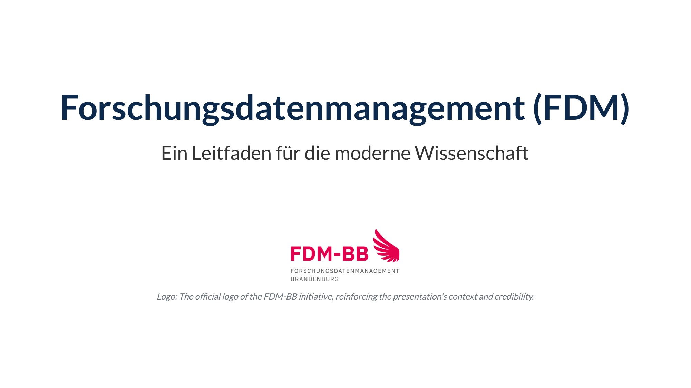
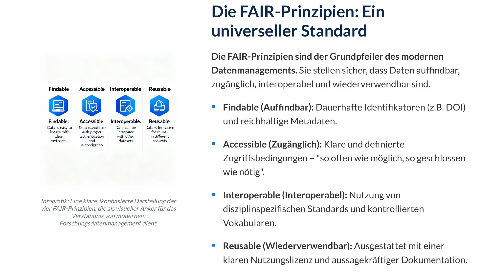
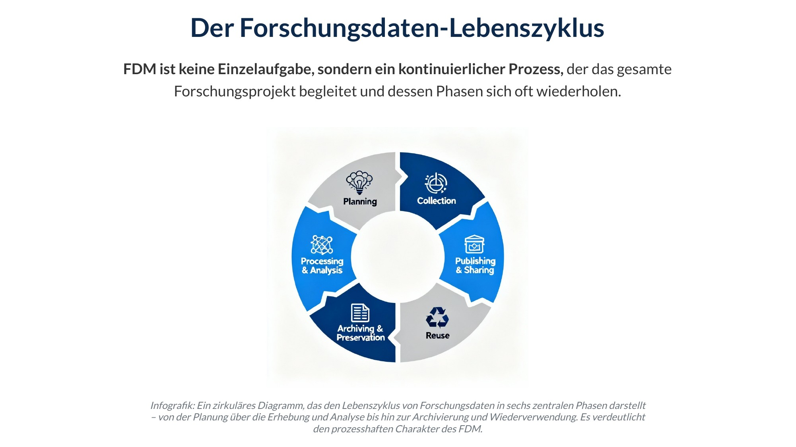
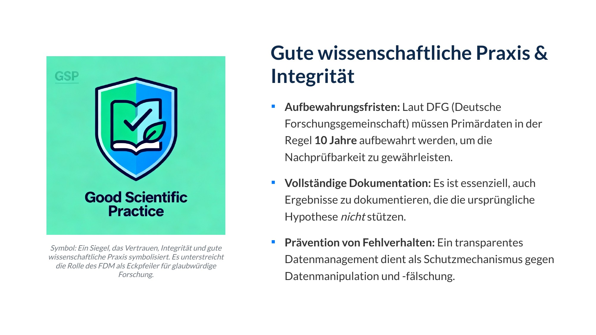
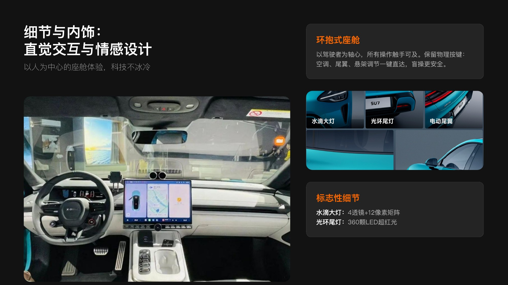
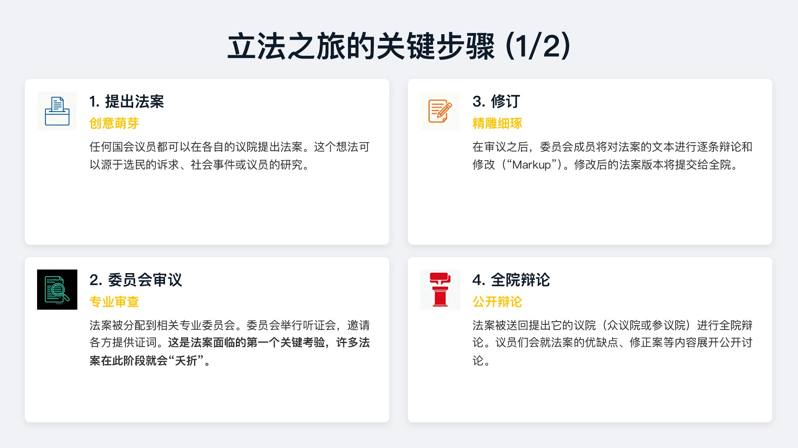
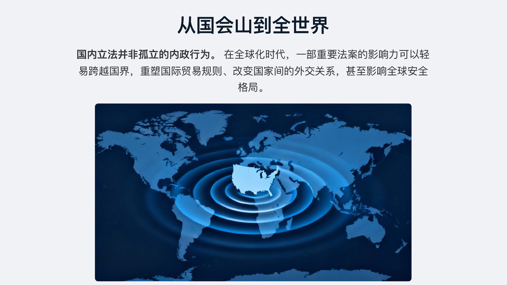
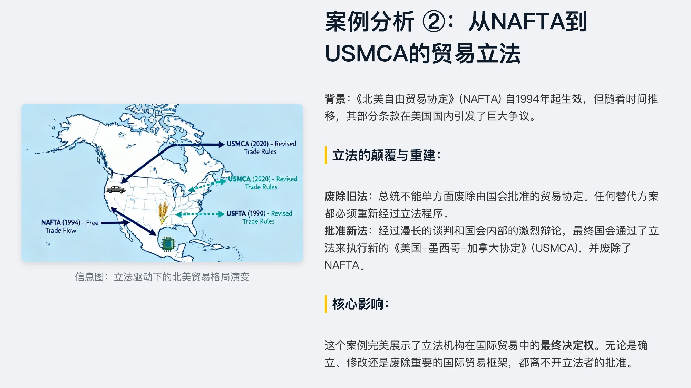
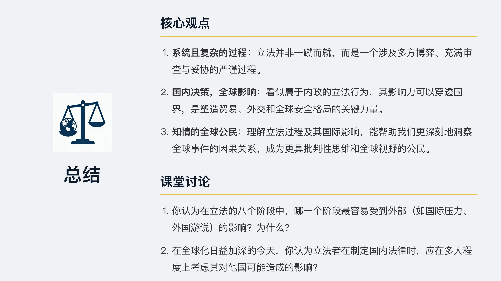

# PPTAgent V3 — Agentic Framework for Reflective PowerPoint Generation

**PPTAgent** 是一个基于大语言模型的多智能体演示文稿自动生成系统。通过 Research → Design/PPTAgent 协作流水线，在 MCP 工具链和 Docker 沙箱环境中，从主题、文档或参考材料出发，自动生成内容充实、设计专业的 PowerPoint 演示文稿。

> Python ≥ 3.11 · Linux/macOS

---

## 系统架构

```
用户输入 (Prompt + 附件)
    │
    ▼
┌─────────────────────────────────────┐
│            AgentLoop                │
│  (deeppresenter/main.py)            │
│                                     │
│  ① Research Agent                   │
│     ├── 网页搜索 (Tavily)           │
│     ├── 论文学术检索 (Arxiv/SS)      │
│     ├── 文件解析 (PDF/DOCX/XLSX)     │
│     ├── 图片搜索/生成/描述           │
│     └── 输出: Markdown 手稿          │
│                                     │
│  ② 生成阶段 (二选一)                 │
│     ├── PPTAgent 模板模式            │
│     │   ├── 分析参考 PPTX 布局       │
│     │   ├── 批量/并发生成幻灯片       │
│     │   └── 输出: .pptx              │
│     │                               │
│     └── Design 自由模式              │
│         ├── HTML/CSS 像素级设计      │
│         ├── Playwright 渲染          │
│         ├── html2pptx 转换           │
│         └── 输出: .pptx / .pdf       │
└─────────────────────────────────────┘
    │
    ▼
  PPTX 演示文稿
```

### Agent 角色

| Agent | 职责 | 关键能力 |
|-------|------|---------|
| **Research Agent** | 内容调研与手稿撰写 | 网页搜索、论文检索、多格式文件解析、图片生成/搜索/描述、长文档摘要 |
| **PPTAgent Agent** | 模板驱动幻灯片生成 | 分析参考 PPTX 布局结构、根据手稿编排内容、调用 MCP 工具逐页/批量生成 |
| **Design Agent** | 自由视觉设计 | HTML/CSS 幻灯片设计、反思式布局校验、`inspect_slide` 工具验证可读性与溢出 |

### MCP 工具生态（7 个 Server，25+ 工具）

| MCP Server | 提供工具 |
|------------|---------|
| `search` | `search_web`, `search_images`, `fetch_url`, `download_file` |
| `research` | `search_papers`, `get_paper_authors`, `get_scholar_details` |
| `any2markdown` | `any2markdown` — PDF/DOCX/XLSX/图片转 Markdown |
| `task` | Todo 管理与 `finalize` 终止信号 |
| `deeppresenter` | `inspect_manuscript`, `inspect_slide` — 布局/可读性校验 |
| `tool_agents` | 图片生成 (T2I)、图片描述 (Caption)、长文档摘要 |
| `pptagent` | `set_template`, `create_slide`, `write_slide`, `generate_slide`, `generate_slides_batch`, `save_generated_slides`, `verify_slide`, `get_trace`, `repair_slide` |

所有 MCP Server 通过 stdin/stdout 子进程通信，支持健康检查与自动重连。

---

## 核心特性

### 双模式生成

- **模板编辑模式** — 基于参考 PPTX 分析布局结构，智能编排内容并编辑幻灯片。内置 6 套模板（beamer/cip/default/hit/thu/ucas），支持用户上传自定义模板
- **自由设计模式** — Design Agent 生成 HTML/CSS，Playwright 渲染后转为 PPTX，支持像素级精细控制

### 实时预览与进度反馈

- 聊天框内嵌幻灯片实时预览（模板/自由模式均支持）
- 预览写入智能节流（每 3 页保存），后台异步转换不阻塞消息流
- HTML 预览增量渲染，新增页面仅处理变更文件
- PPTX 预览基于 `mtime+size` 稳定缓存，未变化不重复转换
- 生成进度实时显示"正在生成第 N/M 页..."

### 高性能生成

- `generate_slides_batch` 批量工具，一次 MCP 调用生成多页
- 非 direct-edit 模式下页面级并发生成 (`asyncio.gather`)
- 文本长度裁剪采用规则化截断（按句子/词边界），消除单页额外 LLM 调用
- 模板按需懒加载，启动时仅读轻量元信息；目录列表 30s TTL 缓存

### 生成质量优化

- **布局选择确定性** — 移除随机 shuffle，布局选择结果可复现
- **内容验证增强** — 检测空内容和过短文本，返回 warnings 供 LLM 重试修复
- **上下文感知编辑** — 编辑器 prompt 包含页码信息和连贯性要求
- **布局多样性** — 跟踪最近使用的布局，提示 LLM 避免连续重复
- **图片分布检查** — 检测图片集中问题，打印 warning 日志
- **WCAG 对比度校验** — `inspect_slide` 工具检查文字与背景颜色对比度（4.5:1/3:1）

### 可验证行为轨迹 (Verifiable Action Traces)

基于确定性规则的视觉质量检查系统，无需 VLM 调用即可检测常见问题，并支持自动修复循环。

**规则引擎** (`deeppresenter/rules/`): 11 条可插拔规则

| 规则 | 检测内容 | 级别 |
|------|---------|------|
| `overflow_text` | 文本溢出容器 | error |
| `overflow_image` | 图片超出幻灯片边界 | error |
| `font_size` | 字号低于可读阈值 | error |
| `contrast_ratio` | WCAG 对比度不达标 | error |
| `overlap_elements` | 元素位置重叠 | warning |
| `safe_margin` | 元素距边缘 < 10pt | warning |
| `layout_repetition` | 连续 3+ 页相同布局 | warning |
| `image_distribution` | 图片集中在单侧 | warning |
| `text_density` | 文字面积 > 60% | warning |
| `image_too_small` | 图片面积 < 5% | warning |
| `image_stretch` | 宽高比异常 | warning |

**动作轨迹** (`deeppresenter/trace/`): 记录每个生成/编辑/修复动作的状态快照、验证结果和 token 消耗，支持 JSON 持久化。

**修复循环**: 检测到 error 级别问题时，基于规则化修复映射（`build_repair_feedback`）指导 coder agent 修复，最多 3 轮迭代。

**MCP 工具**:
- `verify_slide(slide_index)` — 检查指定幻灯片的规则合规性
- `get_trace(action_id?)` — 查询动作轨迹
- `repair_slide(slide_index)` — 对指定幻灯片执行修复循环

### 稳定性与容错

- Playwright 渲染并发控制（2-4），预览优先轻量截图
- 附件解析基于文件 hash 缓存，大文件自动守卫拒绝解析
- MCP Server 健康检查 + 自动重连
- Session 级状态隔离，并发请求速率限制
- Preview 临时目录自动清理，Playwright 进程优雅关闭与泄漏保护
- 关键错误（html2pptx 失败等）显式通知用户

### 交互体验

- WebUI "停止生成"按钮，AgentLoop 级取消机制
- 内嵌系统日志面板（实时查看最近 200 行日志）
- 工作区路径 WebUI 直接配置
- 多种宽高比支持（16:9、4:3、A1-A4）
- 上下文管理（Context Folding），防止 token 溢出

### 离线模式

设置 `offline_mode: true` 可完全离线运行，禁用所有网络依赖工具。需本地部署 MinerU 替代在线 PDF 解析。

---

## 快速开始

### 安装

```bash
# 安装 uv
curl -LsSf https://astral.sh/uv/install.sh | sh

# 首次交互式配置
uvx pptagent onboard

# 生成演示文稿
uvx pptagent generate "Hello World 单页演示" -o hello.pptx

# 带附件
uvx pptagent generate "Q4 汇报" -f data.xlsx -f charts.pdf -p "10-12" -o report.pptx
```

### CLI 命令

| 命令 | 说明 |
|------|------|
| `pptagent onboard` | 交互式配置向导 |
| `pptagent generate` | 生成演示文稿 |
| `pptagent config` | 查看当前配置 |
| `pptagent reset` | 重置配置 |

选项：`-f` 附件 `-p` 页数 `-a` 宽高比 `-l` 语言 `-o` 输出路径

### 本地开发运行

```bash
uv pip install -e .
playwright install-deps && playwright install chromium
npm install --prefix deeppresenter/html2pptx
python webui.py    # → http://localhost:7861
```

### Docker 部署

```bash
docker compose up -d    # → http://localhost:7861
```

---

## 环境配置

```bash
cp deeppresenter/config.yaml.example deeppresenter/config.yaml
cp deeppresenter/mcp.json.example deeppresenter/mcp.json
```

| 配置项 | 说明 |
|--------|------|
| `research_agent` | Research Agent 的 LLM 端点与模型 |
| `design_agent` | Design Agent 的 LLM 端点与模型（推荐多模态模型开反思） |
| `long_context_model` | 长文档摘要模型 |
| `vision_model` | 可选，图片描述模型 |
| `t2i_model` | 可选，文生图模型 |
| `offline_mode` | 离线模式开关 |
| `context_folding` | 上下文折叠，防止 token 溢出 |
| `heavy_reflect` | 重度反思模式，用渲染图片反思设计 |
| `verifiable_reflection` | 可验证反射配置（规则开关、阈值、修复循环、轨迹） |

可选服务质量提升：配置 Tavily API Key（提升搜索质量）、MinerU API Key/URL（提升 PDF 解析质量）。

### 环境变量

| 变量 | 说明 | 默认值 |
|------|------|--------|
| `DP_MAX_CONCURRENT` | 最大并发会话数 | 3 |
| `MINERU_API_KEY` | MinerU 在线 PDF 解析 API Key | - |
| `MINERU_API_URL` | MinerU 离线 PDF 解析服务地址 | - |

---

## 案例展示

#### 文档 → 演示文稿

<div style="display: flex; flex-wrap: wrap; gap: 10px;">
  
  
  
  
  
  
  
  
  
  
</div>

#### 产品介绍：小米 SU7

<div style="display: flex; flex-wrap: wrap; gap: 10px;">
  
  
  
  
  
  
</div>

#### 高中课堂课件："解码立法过程"

<div style="display: flex; flex-wrap: wrap; gap: 10px;">
  
  
  
  
  
  
  
  
  
  
  
  
  
  
  
</div>

---

## 致谢

本项目在 [PPTAgent](https://github.com/icip-cas/PPTAgent) 基础上进行了大量工程优化，感谢原作者的学术贡献。

## License

MIT
